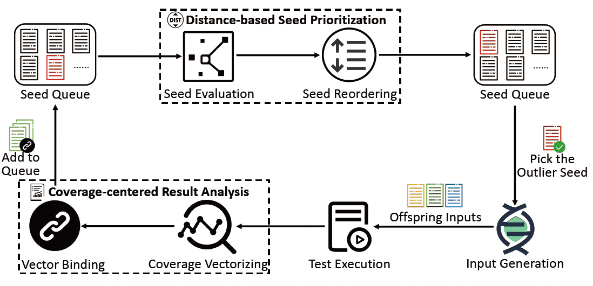
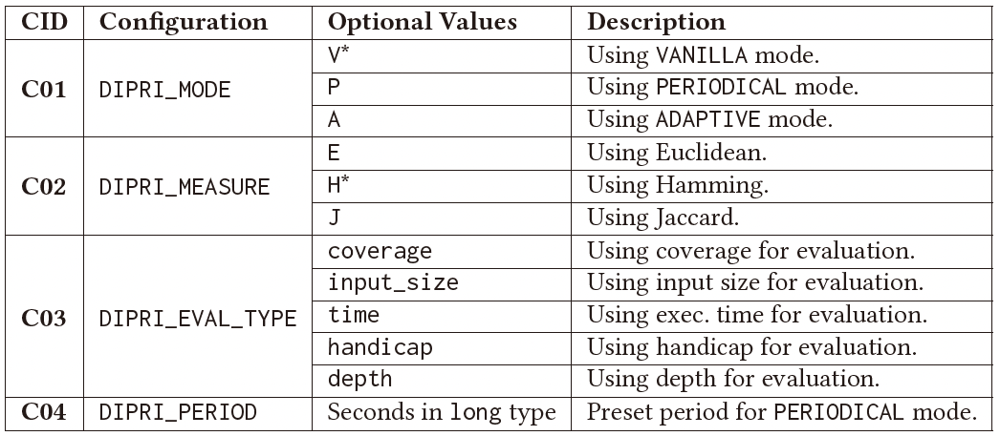

## AFL++-DiPri: AFL++ with Distance-based Seed Prioritization.

This is the C/C++ implementation of our paper: 
_DiPri: Distance-based Seed Prioritization for Greybox Fuzzing._
You can read our [FUZZING'23 paper](https://dl.acm.org/doi/10.1145/3605157.3605172) or TOSEM paper
(under reviewed  at the time this document is updated) to
learn more about the basic hypothesis and approach designs of DiPri..
This prototype is essentially an extension of the famous community-driven fuzzer
AFL++ (version 4.06).
To learn more about AFL++, please refer to their [GitHub repo](https://github.com/AFLplusplus/AFLplusplus) or 
read [AFL++ readme](./README.aflpp.md).

### Approach and Configurations



The above picture shows the high-level workflow of DiPri.
Specifically, DiPri splits seed prioritization into two stages, i.e.,
seed evaluation and seed reordering.
By default, AFL++-DiPri adopts a distance-based strategy to evaluate 
and assign priority scores for seeds.
The distance-based strategy could by controlled through different prioritization
modes and distance measures.
In addition to the proposed distance-based evaluation metric, AFL++-DiPri
supports other general evaluation metrics, such as coverage (`bitmap_size`),
the size of input, the execution time, etc.
The above picture display the configurations supported by AFL++-DiPri, which are
essentially a group of environment variables.
Note that the default configurations is tagged with *.



**Prioritization modes.** DiPri provides three prioritization modes,
namely `VANILLA`, `PERIODICAL`, and `ADAPTIVE`. AFL++-DiPri will conduct
prioritization at different timings under different modes. The features
of the modes are as follows:

- `VANILLA` mode: prioritizes every time the seed queue is updated.
- `PERIODICAL` mode: prioritizes periodically with a preset duration.
- `ADAPTIVE` mode: prioritizes when all last prioritized seeds are picked for input generation.

### Installing and Running AFL++-DiPri

AFL++-DiPri requires no other dependencies than those required by AFL++.
You can refer to [AFL++ install document](./docs/INSTALL.md) to 
preinstall all the dependencies.
After satisfying the prerequisites, you can use the following instructions
to install AFL++-DiPri:

```shell
git clone https://github.com/QRXqrx/aflpp-dipri.git
cd aflpp-dipri
make source-only
```

Though AFL++-DiPri use `VH` config by default, the `AH` is the best
among all the six configurations according to our evaluation.
Say if you want to run AFL++-DiPri under `AE` config, you may use 
the following command:

```shell
DIPRI_MODE=A DIPRI_MEASURE=E <path-to-dipri>/afl-fuzz -i <in_dir> -o <out_dir> -- <target_args>
```
